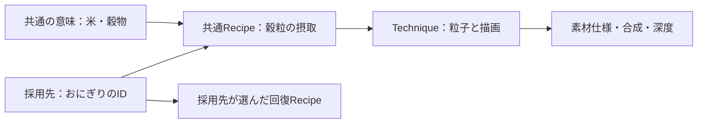

# 共通知識とプロジェクトの採用記録

`knowledge/` には他のゲームでも再利用できる意味・構成・技法・素材仕様・描画・評価を置く。`projects/<project>/` には固有の品目名・ID・マスタ値・採用Recipe・個別調整を置く。プロジェクト文書はノード索引の登録対象外で、共通ノードから依存しない。

## 食べ物の例

「おにぎり」という採用先の品目を、共通側では「食事」「米・穀物」「穀粒の摂取表現」へ落とし込む。抽象化しても、制作構成は小さな長円三粒・象牙白・口元から胸への収束・0.20秒という具体的な初稿を持たせる。

| 層 | 共通側に保存するもの |
| --- | --- |
| Semantic | [食事・飲用](../knowledge/semantics/food-consumption.md)、[料理](../knowledge/semantics/prepared-food.md)、[米・穀物](../knowledge/semantics/grain-food.md)の視覚的な意味 |
| Recipe | [穀粒の摂取](../knowledge/recipes/consumption/grain-consumption.md)の主形状、動き、個数、イベント |
| Technique | [粒子発生・運動](../knowledge/techniques/particle-emission.md)と[板の描画](../knowledge/techniques/billboard.md) |
| Resource / Rendering | [マスク素材](../knowledge/resources/effect-mask-atlas.md)、[合成](../knowledge/rendering/emission-and-opacity.md)、[深度](../knowledge/rendering/world-depth-and-transparency.md)の仕様 |
| 別の意味・Recipe | 実際に回復する場合に採用する[回復](../knowledge/semantics/restoration.md)と[食事由来のHP表示](../knowledge/recipes/states/food-health-restoration.md) |

食事・米という分類はHP回復・攻撃強化を必須にしない。穀粒のRecipeに回復先へのcandidateがあっても、比較・選択しなければ依存へ入らない。満腹度だけを変えるゲームは穀粒表現だけを採用できる。

図の意味からRecipeへの線は探索の流れ。SemanticがRecipeやゲーム効果を自動採用するという意味ではない。

## 攻撃の例

[立体火球](../knowledge/recipes/abilities/volumetric-fireball.md)はメッシュの熱核・連番炎・履歴帯・着弾膨張という主案を持つ。飛翔速度、詠唱時間、着弾半径は採用先の入力。[剣の斬撃](../knowledge/recipes/weapons/weapon-sword.md)は弧メッシュと侵食を主役にし、判定角度と運動面は採用先が渡す。

構成を選んだ主案は `composes: required`、比較候補は `candidate` で区別する。前者もすべての火球・斬撃に対する唯一の一般則ではなく、採用できる具体的なレシピである。

## 保存と更新

共通の改善はRecipeやTechniqueを改訂し、revisionと索引を更新する。プロジェクト固有の改善は採用対応表と制作記録を更新する。実機で得た結果は条件付きのEvidenceとして共通知識へ戻す。エンジン未実行の主案を再現済みへ昇格しない。
