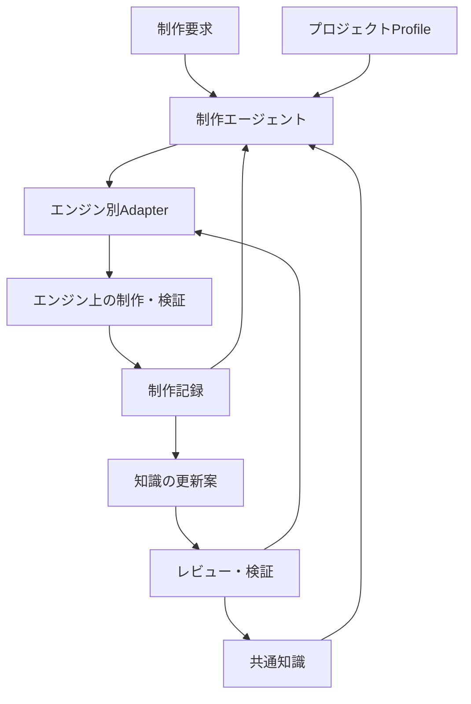
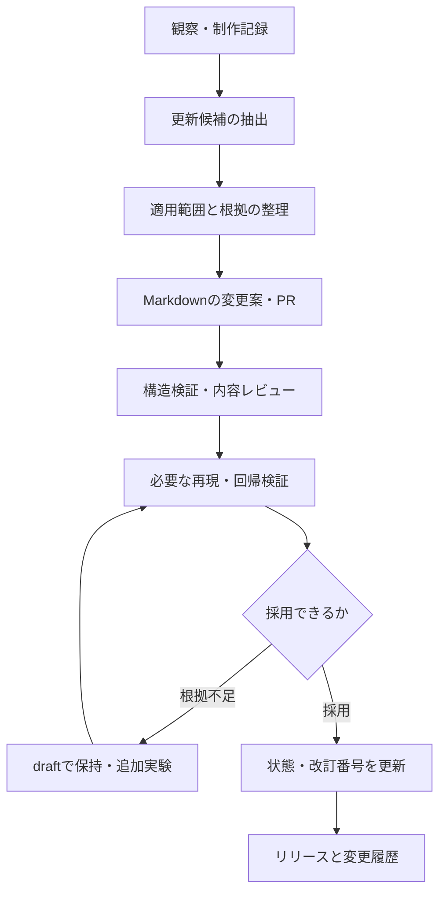

# AI向けリアルタイムVFX知識システム — 概要・設計・運用方針

作成日: 2026-10-04  
文書版: 0.2.0（制作工程改訂2026-10-06。ノードschema_versionは変更なし）
状態: 初期設計案  
想定配置: GitHubリポジトリの `docs/SYSTEM_DESIGN.md`

この文書は、これまでの議論をエンジン非依存の設計として整理したものである。記載する分類、スキーマ、運用規則は本システムの提案仕様であり、既存製品の仕様や実証済みの品質保証ではない。具体的なRecipe、エンジン用ツール、検証プログラム、GitHubリポジトリは、この文書をもとに別途構築する。

## 1. 目標と完成条件

### 1.1 最終目標

**AIに高品質なエフェクトをゲームエンジン上で作らせるワークフローを確立する。**

対象は、メッシュ、パーティクル、シェーダー、テクスチャ、軌跡、描画、時間変化などを組み合わせたリアルタイムの3D VFXである。スプライトシートや単一のシェーダーも構成要素として扱う。

Unity、Unreal Engine、Godotで共有できる抽象的な知識基盤を持ち、各エンジンでは対応する実装方法を選ぶ。初期に登録したRecipeに限らず、制作、評価、失敗分析を通じて知識を追加・更新できるようにする。

### 1.2 「高品質」の意味

高品質を「派手」「写実的」「粒子が多い」と同一視しない。次の条件をプロジェクトの目的に応じて満たすことを品質とする。

| 評価軸 | 満たすべき内容 |
| --- | --- |
| 意図の伝達 | 属性、方向、範囲、強さ、状態などが要求どおりに伝わる |
| 視認性 | 想定する背景、距離、画角で主要な形状が読める |
| 時間設計 | 予備動作、発生、ピーク、減衰、終了がゲームの動作に合う |
| 空間的な成立 | カメラ移動、接地、奥行き、遮蔽に対して破綻しない |
| 美術的な整合 | プロジェクトの色、形、密度、質感の基準に合う |
| ゲームプレイとの整合 | 当たり判定や予告範囲の理解を妨げない |
| 性能 | 対象環境と同時表示条件で予算内に収まる |
| 運用性 | 再生、停止、再利用、調整、引き継ぎが安定して行える |

この表はゲーム用の到達点を含む。最高品質基準版Aではコストを度外視し、美術品質の完成を追求する。性能・製品運用・ゲーム統合の合格は別工程Bで判定する。工程の正本は[WORKFLOW](WORKFLOW.md)。

具体的な合格値はプロジェクト側で決める。共通知識側で「粒子数100以下なら合格」のような一律の基準は設けない。

### 1.3 初期の完成条件

1. ユーザー要求から構成候補を選び、選択理由と棄却理由を説明できる。
2. 選択した構成を、対象エンジンの実装計画へ変換できる。
3. 実装結果を実機または適切な検証環境で再生し、動きと性能を評価できる。
4. 不足や失敗があれば、原因の仮説を立てて修正できる。
5. 制作で得た知見を、根拠と適用条件を伴う知識の更新案として残せる。
6. 複数プロジェクトで同じ版の知識を参照し、更新前後を比較できる。

Markdownだけで1〜6が自動実行されるわけではない。Markdownは知識の正本であり、実際に動かすAIエージェント、エンジン操作手段、撮影・計測手段、レビュー工程を組み合わせてワークフローを成立させる。

## 2. 設計の基本原則

### 2.1 知識を外部化し、必要な範囲だけ取得する

AIの内部知識だけに制作判断を依存させず、判断規則をMarkdownとして明示する。すべてのファイルを毎回読み込ませるのではなく、要求に関係する知識と依存先を取得する。

Coplayの一次資料では、巨大なシステムプロンプトに代えてRecipeを取得する方式を採り、テクスチャ生成と視覚的なフィードバックを加えた実験が報告されている。ただし対象は初期段階のパーティクル中心の制作であり、本設計のエンジン横断運用や品質保証まで実証している資料ではない。[S1]

### 2.2 Recipeは候補と判断基準を持つ

「斬撃なら必ずメッシュ」「ファイアボールなら必ずビルボード」という固定対応は作らない。表現意図、形状、動き、カメラ、美術、性能、利用可能な機能をもとに候補を選ぶ。

調整値を含む完成例は有用だが、値の単位、対象環境、適用条件を併記し、一般的な判断規則と区別する。

### 2.3 共通知識と実装知識を分離する

共通知識では、エンジン固有のクラス名、アセット形式、UI操作手順を必須条件にしない。実装知識では、その抽象表現を対象エンジンの機能へ対応付ける。

たとえば「移動履歴から帯状の軌跡を生成する」は共通知識であり、「UnityのTrailRendererを設定する」はUnity用の実装知識である。

### 2.4 実測と仮説を区別する

見た目の予想、一般的な制作の経験則、公式仕様、実測結果を混同しない。「低負荷」「高品質」「全エンジン対応」といった評価には、対象条件と根拠を添える。

### 2.5 成長はレビュー可能な知識更新として行う

ここでいう成長は、モデルの重みの再学習ではない。ノード、関係、判断条件、実装方法、検証記録を更新することを指す。

AIは制作結果から更新案を作れる。ただし、一度の成功や自己評価を理由に共通知識を即座に確定しない。検証記録と変更差分をレビューできる形にする。

## 3. システム全体の構成

| 構成要素 | 役割 | 主な保存場所 |
| --- | --- | --- |
| 共通知識 | 意味、構成、技法、素材、評価方法の判断規則 | 共有GitHubリポジトリ |
| エンジン別Adapter | 共通の表現仕様を各エンジンの機能へ対応付ける | 共有リポジトリの `adapters/` |
| プロジェクトProfile | 美術、カメラ、機能、性能、権限、制作規約を定義する | 各プロジェクト |
| 制作エージェント | 要求整理、知識取得、設計、実装、修正を実行する | 利用側のAI環境 |
| 実行・検証環境 | エンジン操作、再生、撮影、ログ取得、性能計測を行う | 各プロジェクト・ツール環境 |
| 制作記録 | 採用案、変更、結果、未解決事項を記録する | 原則として各プロジェクト |
| 知識更新工程 | 記録から一般化した更新案を作り、レビュー・配布する | 共有リポジトリのPRとリリース |



Adapterは単なる用語の置換表ではない。機能差、利用条件、設定方法、フォールバック、検証方法まで持つ。共通化するのは表現意図と設計判断であり、アセットやソースコードの完全互換を目標にしない。

## 4. 知識ノードの分類と責務

### 4.1 採用する分類

| 種別 | 問い | 内容の例 |
| --- | --- | --- |
| `semantic` | 何を伝えるのか | 斬撃、火炎、回復、毒、バリア、強い衝撃 |
| `composition` | どの役割を組み合わせるのか | 投射体、着弾、持続範囲、武器軌跡、オーラ |
| `recipe` | 条件に対してどの構成が有力か | 輪郭重視の魔法弾、固定形状の斬撃、軽量な持続バリア |
| `technique` | 各役割をどう表現するのか | 軌跡生成、ビルボード、UVスクロール、侵食、深度フェード |
| `resource` | どの素材と仕様が必要か | ノイズ、形状マスク、メッシュ、Flipbook、法線 |
| `rendering` | どう合成・描画するのか | 加算、アルファ合成、深度、ソート、歪み |
| `evaluation` | 成否をどう確かめるのか | 時間設計、輪郭、接地、重なり、性能の検証 |
| `adapter` | エンジン上でどう実現するのか | Unity、Unreal Engine、Godotの実装方法 |
| `evidence` | その判断を何が支えるのか | 公式資料、再現実験、採用例、失敗例 |

同じ種別のノード間にも関係を作れる。分類は保存と検索のための境界であり、知識の依存関係を一方向の階層に限定しない。

### 4.2 SemanticとRecipeの境界

Semanticは、表現する意味と視覚上の要求を定義する。Recipeは、それを実現する条件付きの構成案を定義する。

たとえば `semantic/fireball` には、球状にまとまった火炎の投射体、飛翔方向、着弾、火炎属性の読み取りなどを書く。核をメッシュにするか、スプライトにするかは固定しない。

`recipe/fireball-readable-core` には、核、炎の外周、尾、着弾という役割と、それぞれの候補、採用条件、時間関係を書く。

### 4.3 CompositionとRecipeの境界

Compositionは、複数のエフェクトで共有する役割構造である。たとえばProjectileは、発射、飛翔、軌跡、着弾、終了の関係を定義する。

Recipeは、特定の要求や利用条件に対して、そのCompositionをどう組み立てるかを具体化する。Recipeから別のRecipeを部分構成として参照してもよいが、自己参照や循環した必須構成は許可しない。

### 4.4 技法は異なる軸を混同しない

Particle、Billboard、Flipbook、Additiveは、互いに排他的な技法ではない。

| 軸 | 選択内容の例 |
| --- | --- |
| 発生・シミュレーション | 粒子、単一オブジェクト、履歴点列、GPUシミュレーション |
| 形状・配置 | メッシュ、帯、板、カメラ向きの板、球状の分布 |
| 素材 | 静的マスク、連番テクスチャ、ノイズ、手続き形状 |
| 見た目の時間変化 | 侵食、UV移動、色変化、頂点変形 |
| 合成・深度 | 加算、アルファ合成、深度参照、描画順 |

「粒子をビルボードで描画し、Flipbookを再生し、加算合成する」という組み合わせが成立する。候補選定時は軸ごとに判断し、名前の一覧から単一の技法だけを選ばせない。

TrailとRibbonなど、文脈によって意味が重なる名称は `GLOSSARY.md` で定義する。共通知識での用語と、各エンジンの機能名も区別する。

## 5. Markdown知識グラフのデータモデル

### 5.1 正本と派生物

正本は、YAML Front Matterを持つMarkdownファイルとする。ノード一覧、逆参照、検索用JSON、図、将来のベクトル索引は正本から生成する派生物とする。

派生物を直接修正して知識を変更しない。SQLやGraph DBは初期段階で導入しない。将来検索基盤を追加する場合も、Markdownから再構築できる状態を維持する。

### 5.2 ノードの識別

| 項目 | 規則 |
| --- | --- |
| ID | `種別/英語のkebab-case名`。例: `technique/history-ribbon` |
| IDの一意性 | リポジトリ全体で一意 |
| IDの継続性 | ファイル移動やタイトル変更でも変更しない |
| ファイル名 | 英語のkebab-caseを標準とし、大文字小文字だけで区別しない |
| 本文 | 初期は日本語。コード識別子や既存用語は必要に応じて英語 |
| 別名 | 日本語、英語、通称を `aliases` に登録する |
| ノード粒度 | 一つの主要な概念・判断を、独立して参照できる単位にする |

一つのRecipeが長くなる場合は、共有部分をCompositionやTechniqueへ分離する。短い断片を過度に分割して、基本的な判断に大量のファイルが必要になる状態も避ける。

### 5.3 共通メタデータ

| フィールド | 必須 | 意味 |
| --- | --- | --- |
| `schema_version` | 必須 | このFront Matterの構造の版 |
| `id` | 必須 | 安定したノードID |
| `kind` | 必須 | ノード種別 |
| `title` | 必須 | 表示名 |
| `summary` | 必須 | 検索と選択に使う短い説明 |
| `status` | 必須 | `draft / reviewed / validated / deprecated` |
| `revision` | 必須 | ノード内容の改訂番号。初回は1 |
| `updated_at` | 必須 | 最終更新日。`YYYY-MM-DD` |
| `aliases` | 必須 | 検索用の別名。ない場合は空配列 |
| `tags` | 必須 | 管理された語彙によるタグ。ない場合は空配列 |
| `scope` | 必須 | `engine-neutral / engine-specific` |
| `relations` | 必須 | 関係の配列。ない場合は空配列 |
| `evidence` | 必須 | 根拠ノードのID配列。ない場合は空配列 |
| `superseded_by` | 条件付き | 廃止後の置換先ID。ない場合は空配列 |
| `engine`、`compatibility` | Adapterで必須 | エンジン名、版、描画方式、検証済み条件 |

ノード内の判断が異なる根拠を持つ場合は、本文の該当する主張にも根拠IDを添える。ノード全体に一つの証拠があるだけで、すべての記述が検証済みとは扱わない。

### 5.4 状態と根拠の意味

| 状態 | 意味 | 通常の扱い |
| --- | --- | --- |
| `draft` | 提案・仮説。内容レビューが未完了 | 実験候補として明示的に選ぶ |
| `reviewed` | 概念、条件、出典、構造をレビュー済み | 通常の候補に含める |
| `validated` | 記録された対象条件で再現確認済み | 検証条件が要求に合うか確認して使う |
| `deprecated` | 新規利用を推奨しない | 既存利用の理解と移行のために残す |

`validated` は無条件の正解や全エンジン対応を意味しない。Semanticの意味定義をレビューしたことと、Recipeをエンジン上で検証したことは別である。検証内容はEvidenceに記録する。

根拠は、少なくとも `official-documentation / first-party-experiment / reproduced-test / production-observation / hypothesis` に区別する。数値の信頼度や重みを初期から付けず、根拠の種類、適用範囲、検証日を使って判断する。

## 6. 関係とリンクの規約

### 6.1 関係の語彙

| `type` | 意味 | 必須性 |
| --- | --- | --- |
| `expresses` | このRecipeなどが表現する意味 | 依存を示さない |
| `composes` | この構成の一部として使う | 構成要素。必須かは `requirement` で示す |
| `candidate` | 条件に応じて選ぶ実装・構成候補 | 任意選択 |
| `requires` | 採用した場合に必要な知識・素材・能力 | 指定条件下で必須 |
| `enhances` | 表現を補強する補助要素 | 任意 |
| `alternative` | 同じ役割の代替候補 | 代替 |
| `conflicts_with` | 指定条件下で両立しない、または問題を起こす | 条件付き制約 |
| `implemented_by` | 抽象的な技法を実装するAdapter | 実装への対応 |
| `evaluated_by` | 評価に使う検証項目 | 検証への対応 |

各関係には `target`、`type`、`reason` を必須とする。必要に応じて `when`、`role`、`requirement`、`evidence` を加える。`when` は初期段階では人間とAIが読む条件記述であり、そのまま自動実行できる式とは扱わない。

`requirement` は `composes` で `required / optional` のいずれかを指定する。`requires` は、それ自体が必須依存を表す。関係の強さを曖昧な数値で表す代わりに、役割と条件を明記する。

### 6.2 方向と逆参照

関係は登録した方向を正本とする。たとえば「Recipe → 技法候補」と「技法 → 利用しているRecipe」を両方手で管理しない。後者は逆参照索引から求める。

代替や競合のように双方向で読める関係は、関係仕様で対称と定義し、索引生成時に逆方向の表示を作る。本文の重複記述で整合性を保とうとしない。

一般的な関連リンクの循環は許可する。必須構成と必須依存のグラフでは、条件付きの循環も含めてチェックし、解決不能な循環を禁止する。

### 6.3 Markdownリンクとの対応

機械処理の正本はIDによる `relations` とする。本文にはGitHubで読みやすい相対Markdownリンクを置ける。リンク先パスが存在し、意味上の依存先がメタデータにも記載されていることを検証する。

読み物への補助リンクは、必須依存として登録する必要はない。外部資料はEvidenceで管理し、参照URL、確認日、資料の種類、対象バージョンを残す。

ファイル移動時はIDを維持し、本文のリンクと索引を更新する。ノードを統合・廃止する場合は `deprecated` と置換先を残し、過去の制作記録から追跡できるようにする。

## 7. ノード本文の標準構成

| 種別 | 必ず書く内容 |
| --- | --- |
| Semantic | 意味、必要な視覚的特徴、誤解されやすい表現、関連する構成候補 |
| Composition | 要素の役割、必須と任意、時間・空間の関係、削減時の優先順位 |
| Recipe | 適用条件、不向きな条件、役割ごとの候補、選択理由、失敗例、評価方法 |
| Technique | 原理、向く用途、弱点、代替、必要素材、能力要件、性能を左右する条件 |
| Resource | 用途、寸法・単位・チャンネル等の仕様、生成・調達方法、検証、利用条件 |
| Rendering | 合成と深度の考え方、必要機能、背景依存、典型的な破綻、検証方法 |
| Evaluation | 検証目的、入力条件、操作、観察・計測、合格判定、証拠の残し方 |
| Adapter | 共通仕様との対応、互換条件、実装手順、設定、フォールバック、再現検証 |
| Evidence | 対象の主張、根拠の種類、条件、結果、未検証範囲、参照元、確認日 |

Techniqueでは「GPUは速い」のような無条件の説明を避け、シミュレーション、描画、転送、透明面積、機能制約を分けて考える。Recipeでは、想定する最良例だけでなく、採用を避ける条件や簡略化案も残す。

## 8. エンジン非依存の中間仕様

### 8.1 必要な理由

Recipeから直接エンジンの設定値へ飛ぶと、エンジンを変えた際に設計判断までやり直すことになる。そこで制作ごとに、共通のEffect Specificationを作る。

初期段階では構造化MarkdownまたはYAMLでよい。専用のコンパイラーや共通アセット形式は必要ない。中間仕様は設計上の契約であり、エンジンへ自動変換できることを初期要件にしない。

### 8.2 中間仕様に含める項目

| 項目 | 内容 |
| --- | --- |
| 意図 | 表現する意味、ゲーム上の用途、成功条件 |
| 入出力 | 発生位置、方向、対象、サイズ、色、再生・停止イベント |
| レイヤー | 主役、補助、アクセント、着弾などの役割 |
| 形状 | 輪郭、寸法、分布、姿勢、追従対象 |
| 動き | 速度、加速度、乱れ、回転、軌跡、変形 |
| 時間 | 開始条件、相対時刻、継続、減衰、終了 |
| 素材 | メッシュ、テクスチャ、マスク、シェーダー機能の要件 |
| 描画 | 合成、深度、遮蔽、必要な画面情報 |
| 能力要件 | 深度テクスチャ、画面色参照、GPU演算等の必要能力 |
| 品質段階 | 省略可能な要素と、低品質時にも保持する主要な情報 |
| 検証 | 視認性、時間、複数視点、実機負荷、停止・再利用の確認 |

### 8.3 単位と座標

抽象仕様の時間は秒、物理的な距離はメートル、角度は度を標準とする。実装側でエンジン・プロジェクトの単位に変換する。ゲーム内スケールと物理スケールが異なる場合はProfileに変換規則を置く。

方向は、エンジンの固定軸に依存する表記だけでなく、`forward / up / surface-normal` など役割で指定する。右手系・左手系、ローカル・ワールド・画面空間、メッシュ原点、UV、アルファ方式、線形色と表示色の扱いはAdapter側で明示する。

距離や速度が未確定なら、基準半径や基準時間に対する比率を使える。ただし無次元量であることと、その基準を必ず書く。

### 8.4 イベントと時間の契約

一般的なイベントとして `spawn / launch / impact / stop / complete` を使える。これは共通の意味定義であり、特定のAPIを要求するものではない。

投射体の着弾を「再生開始0.5秒後」に固定しない。実際の着弾イベントを起点に、フラッシュや煙の相対時刻を定義する。固定時間でよい部分と、ゲームイベントに従う部分を分ける。

当たり判定、ダメージ、移動ロジックの正本はゲーム側に置く。視覚表現が独自にゲーム上の結果を確定しない。必要なゲーム状態を入力として受け取り、見た目を構成する。

## 9. エンジン別Adapter

### 9.1 共通表現と実装候補の対応例

次は機能群の対応例であり、一対一の変換や同等性能を保証するものではない。[S2][S3][S4]

| 共通表現 | Unityの候補 | Unreal Engineの候補 | Godotの候補 |
| --- | --- | --- | --- |
| 粒子の発生・寿命・動き | Particle System、VFX Graph | NiagaraのSystem・Emitter・Module | GPUParticles3D、CPUParticles3D |
| 板・メッシュの描画 | 粒子Renderer、MeshRenderer等 | NiagaraのSprite・Mesh Renderer等 | 粒子の描画メッシュ、MeshInstance3D等 |
| 軌跡・帯 | TrailRenderer、粒子Trail、独自メッシュ等 | Niagara Ribbon、独自メッシュ等 | 粒子Trail、独自メッシュ等 |
| 見た目・侵食・UV変化 | Shader Graph、ShaderLab/HLSL等 | Material Editor、必要に応じたHLSL等 | Spatial Shader、Visual Shader等 |
| 要素の同期・制御 | スクリプト、アニメーション、Timeline等 | Blueprint、Niagara制御、Sequencer等 | スクリプト、AnimationPlayer等 |

同じ名称でも、生成される形状、履歴の扱い、描画方式、停止処理は異なる。対応表から採用し、実際のバージョン・Renderer・プラットフォームで確認する。

### 9.2 Adapterの記載項目

1. 対応する共通知識IDと能力要件。
2. 対象エンジン、バージョン、描画方式、関連パッケージ・プラグイン。
3. 公式資料と確認日。
4. エンジン上の構成、設定項目、単位・座標変換。
5. 作成・更新・再生・停止・破棄・再利用の手順。
6. CLI、スクリプト、Editor API、MCP、UI操作等の利用可能な自動化手段。
7. コンパイル、ログ、撮影、性能計測の方法。
8. 非対応条件と代替案。
9. 実際に検証した環境と記録。

ノード編集、テキストコード生成、Editorスクリプトのどれを使うかは、ツールの能力とプロジェクトの運用から選ぶ。「AIには常にHLSLが最適」といった固定ルールは共通知識に置かない。

### 9.3 能力ベースで選ぶ

技法が必要とする能力を、ProfileとAdapterの能力一覧と照合する。

能力の例は、`particle-simulation / history-ribbon / scene-depth-sampling / scene-color-sampling / gpu-compute / per-instance-parameters / runtime-parameter-control` である。各能力には対応条件と確認状態を付ける。

非対応は候補から除外する。未確認は対応済みと見なさず、必要なら小さな検証を行う。たとえば画面色参照を使う歪みが使えない場合は、歪みを省き、形状や色変化で補う案を選べる。

## 10. プロジェクトProfileとローカル拡張

### 10.1 Profileに必要な項目

| 分野 | 定義内容 |
| --- | --- |
| エンジン | エンジン、版、Renderer、関連機能、操作ツール |
| 対象環境 | 端末、OS、解像度、品質設定、目標フレームレート |
| カメラ | 投影方式、距離、画角、移動範囲、エフェクトの画面占有率 |
| 美術 | 色、形、明度、輪郭、質感、密度、参照作品・素材 |
| ゲーム性 | 予告、範囲、優先情報、敵味方の区別、遮ってはいけない情報 |
| 性能 | CPU/GPU予算、同時表示、透明面積、メモリ、ロード条件 |
| 実装規約 | 命名、保存先、アセット構成、パラメータ、再利用方式 |
| 制作権限 | 編集可能範囲、利用可能ツール、レビュー担当 |
| 検証 | 必須場面、キャプチャ方法、計測方法、採用条件 |
| 知識参照 | 共通知識の固定コミット、Profile版、ローカル拡張の一覧 |

未定の項目は未定と記載する。性能予算を決められない段階でも構成試作は可能だが、性能合格や本番採用を宣言しない。

### 10.2 制約の適用順序

必須条件を先に適用し、残った候補を品質とコストで比較する。必須条件の衝突を、曖昧な総合点で相殺しない。

1. エンジン・プラットフォーム上で利用可能か。
2. プロジェクトの禁止事項・必須規約を満たすか。
3. 今回のゲームプレイ上の要件を満たすか。
4. 美術、見た目、制作コスト、性能からどの候補が適するか。

ユーザーの個別依頼がProfileの必須条件と衝突する場合は、実行環境や規約の変更が必要かを示す。AIが黙って条件を無効化しない。

### 10.3 ローカル拡張

プロジェクト独自のRecipe、Technique、評価方法は、プロジェクト内の `vfx/local-knowledge/` に置く。IDには `project/<project-key>/...` の名前空間を使い、共通IDを上書きしない。

既存の共通知識に対するローカルな制約は、Profileの `overrides` で対象IDと差分を記録する。共通知識をコピーして無関係な版として編集する運用は標準にしない。

既存のエフェクト方針文書がある場合はProfileから参照し、内容を読んで必要な制約へ変換する。本設計では、既存文書の未確認の内容を共通知識として取り込まない。

## 11. 制作ワークフロー

2026-10-06改訂。工程の正本は[WORKFLOW](WORKFLOW.md)、具体的な工程・成果物・到達条件・戻り先は[Aの工程表](docs/QUALITY_BASELINE_WORKFLOW.md)と[Bの工程表](docs/GAME_ASSET_WORKFLOW.md)。ここへ工程表の写しを置かない。

### 11.1 制作の二段階

Aは全体像・時間演出を先に設計し、表現上の役割へ因数分解してから技法を選ぶ。主役と各要素を作り込み、合成と通常速度の全体再生で研磨し、人間が最高品質基準版として承認するまで完成扱いにしない。制作/描画コストや既存資産への適合を品質の上限にしない。

Bは承認された完成実物を改めて因数分解し、品質を保つゲーム用変換を別の成果物として行う。外観承認、ゲーム接続、性能は別々の判定。Aの途中へBの削減を混入させない。

### 11.2 工程を実行する記録

[品質制作計画](templates/QUALITY_BASELINE_PLAN.md)へ各工程の成果物と実物の評価を記録する。全体像・時間表・役割表がないまま既存素材の設定修正へ進まない。機械確認は美術評価を代行しない。部分修正後も全体連続再生と過去指摘の再発を照合する。

### 11.3 不明点と反復

完成像や運動を大きく変える不明点は確認する。Recipeがなくても意味と役割から構成を設計し、未知の表現を実物で試作する。未実証案を検証済みとしない。

Aは反復回数・制作時間・自己評価点で品質の上限や完成を決めない。作業上中断する場合は未完成と不足・再開工程を残す。方向性の確認を最高品質の完成承認へ繰り上げない。

## 12. 知識取得とRecipe選択

### 12.1 検索の順序

1. `README.md`、`WORKFLOW.md`、Profile、固定した知識版を確認する。
2. 要求から意味、動き、形状、時間、美術上の修飾を抽出する。
3. タイトル、別名、タグ、要約からSemanticとRecipeの入口を探す。
4. CompositionとTechnique候補を取得する。
5. 必須依存、弱点、代替、評価方法、Evidenceを読む。
6. エンジン能力、カメラ、制約で候補を絞る。
7. 重要な主張と検証条件が要求に合うか確認する。
8. 設計に使ったノードIDと版を制作記録に残す。

初期実装はファイル名、`rg`、メタデータ索引でよい。件数が増えたら全文検索や意味検索を追加できる。ただし意味的に近い検索結果を、そのまま適用可能なRecipeと見なさない。

### 12.2 読み込み範囲の制御

全ノードを読み込まず、検索結果の要約から候補を選び、採用に関係する本文を読む。通常は入口から数段の関連を探索するが、採用した技法の必須依存は探索上限で省略しない。

必須依存を取得できない、前提が不明、コンテキスト容量が足りない場合は、その不足を記録して取得範囲または構成を見直す。要約は元のIDと改訂番号を保持し、未確認事項を消さない。

### 12.3 選択理由の記録

採用案ごとに、少なくとも次を残す。

- この役割を満たす技法は何か。
- なぜ今回のカメラ、形状、動きに合うか。
- 必要な能力と素材は利用可能か。
- 既知の弱点をどう回避・検証するか。
- 候補を棄却した理由は何か。
- 根拠のうち実測、経験則、仮説はどれか。

数値化したランキングは初期には必須としない。選択理由を比較できる記録の蓄積後に導入を検討する。

## 13. 評価・検証の設計

### 13.1 静止画だけで評価しない

VFXは時間変化を持つため、開始、ピーク、減衰、終了のキャプチャと動画を基本とする。Coplayの資料では、初期の近似として粒子数が最大になるフレームを撮影しているが、本システムではそれだけを合格根拠にしない。[S1]

発射、飛翔、着弾、停止などのイベントごとに見る。速度や同時表示数を変えた条件も、用途に応じて確認する。

### 13.2 視覚検証

| 条件 | 主な確認内容 |
| --- | --- |
| 明るい背景・暗い背景 | 核、輪郭、尾が必要な明度差を持つか |
| 近距離・遠距離 | 形状と属性が読めるか、細部がちらつかないか |
| 想定視点と端の視点 | 板が薄くなる、帯が反転する等の破綻がないか |
| 地面・壁・遮蔽物 | 接地、貫通、深度、ソートが許容範囲か |
| 単体・重なり | 飽和、情報の埋没、範囲の誤認が起きないか |
| 複数の乱数Seed | 偶然の一回だけで成立していないか |
| 通常速度・必要なら低速 | 予備動作、ピーク、減衰、イベント同期が適切か |

想定カメラ以外の全方向で成立させることを必須にしない。検証範囲はProfileから決める。

### 13.3 性能検証

測定には、ハードウェア、エンジンと描画設定、解像度、背景、同時表示数、描画距離、乱数Seed、ウォームアップ、測定区間、測定手段を添える。

可能であれば同条件でエフェクト有無や変更前後を比較する。CPUとGPUを分け、平均だけでなくピークや分布も見る。GPU処理や描画の相互作用があるため、差分値を他の場面へ単純に加算できるとは扱わない。

透明面積、Overdraw、粒子数、Material数、Draw Call、テクスチャ容量などは原因を探る指標であり、それだけで最終性能を保証しない。性能判定はプロジェクトの対象環境で行う。

### 13.4 運用検証

再生途中の停止、再発生、Pool等からの再利用、スケール変更、追従対象の消失、画面外からの復帰などを、利用方法に応じて確認する。停止後の残留物や以前のパラメータが再利用時に残らないかを見る。

### 13.5 自動評価と人の評価

コンパイルエラー、欠落アセット、寿命、設定値、計測値は自動確認に向く。意図の伝達、美術的な整合、ゲームプレイ上の読み取りには視覚評価と担当者の判断を組み合わせる。

AIの画像・動画評価は修正候補の発見に使えるが、単独で高品質を保証しない。AIが提案した設定を、設定の存在確認だけで合格させるような検証は避ける。

### 13.6 Benchmarkケース

各制作の検証と、知識更新時の回帰検証を分ける。回帰検証は、固定した要求、Profile、カメラ、Seed、期待する視覚情報を持つ少数の代表ケースから始める。

例として、固定形状の斬撃、動的な武器軌跡、魔法投射体と着弾、短時間の爆発、持続バリアを使う。画像の完全一致を要求せず、必須情報、時間、破綻、性能の悪化を確認する。

エンジン横断検証では、同一アセットや画素の一致ではなく、同じ表現要件を各エンジンで満たせるかを検証する。

## 14. 制作記録とEvidence

### 14.1 制作記録の必須項目

| 分野 | 記録内容 |
| --- | --- |
| 識別 | 制作ID、日時、担当、プロジェクト、要求 |
| 知識版 | リポジトリのコミット、スキーマ版、利用ノードIDと改訂番号 |
| 環境 | Profile版、エンジン・Renderer・ツール・パッケージの版 |
| 設計 | 候補、採用・棄却理由、仮定、Effect Specification |
| 実装 | アセット参照、設定、Seed、再生・撮影・計測手順 |
| 反復 | 変更前の問題、原因仮説、変更内容、変更後の結果 |
| 評価 | 動画・画像・ログ・計測値、合格項目、未解決事項 |
| 結果 | 採用、条件付き採用、棄却、継続実験 |
| 更新候補 | 一般化できる知見、対象ノード、適用範囲 |

制作記録は原則としてプロジェクト内に置く。共通知識に必要な部分だけを、機密情報や共有不可の素材を除いたEvidenceとして移す。

### 14.2 Evidenceの扱い

成功例と失敗例の両方を残す。失敗の原因が不明な場合は不明と記録し、「Trailが悪い」などの広すぎる一般化をしない。

制作記録からEvidenceを作る際は、観察、原因仮説、確定した結論、未検証範囲を分ける。外部資料からの情報は出典を記録し、本文やアセットの転載を当然の前提にしない。

第三者資料のURLが失効した場合も、どの主張の根拠だったか分かる書誌情報と確認日を残す。根拠が検証できなくなった判断は、再確認の対象にする。

## 15. 成長・更新のワークフロー

### 15.1 更新の契機

- 既存Recipeが想定条件で成立しなかった。
- 既存の候補より適した技法や構成が見つかった。
- 未登録の表現を既存知識から設計し、再利用の価値が見つかった。
- エンジン更新で機能、挙動、操作方法、互換条件が変わった。
- 複数の制作で同じ回避策や構成が繰り返された。
- 出典の不足、矛盾、誤った条件、重複ノードが見つかった。

### 15.2 更新工程



### 15.3 一般化する前の判断

| 得られた知見 | 主な反映先 |
| --- | --- |
| 色やサイズなど一つの作品に固有の調整 | プロジェクトの制作記録・Profile |
| エンジン固有の設定や挙動 | 該当Adapter |
| 条件付きで再利用できる構成 | Recipe |
| 複数の表現で使える技法の判断 | Technique |
| 見た目の失敗を発見する方法 | Evaluation |
| 根拠が少ない新しい可能性 | `draft` のノードとEvidence |

一つのエンジン・一つのカメラで成功した結果を、全エンジンの一般則へ昇格させない。抽象的な結論が妥当でも、実装の検証範囲は分けて残す。

### 15.4 AIによる更新とレビュー

AIは、新規ノード、リンク、選択条件、弱点、Evidence、廃止候補を提案できる。標準運用では、共有版の変更はPRでレビューする。自動化する場合も、提案の作成と、採用・公開・リリースの責任を分けて定義する。

レビューでは、対象の問題、変更後の判断、根拠、適用範囲、影響するノード、回帰検証、移行方法を確認する。単に成功例の見た目が良いという理由で、以前の判断規則を置き換えない。

### 15.5 矛盾、廃止、分岐

新旧の知見が矛盾する場合は、カメラ、背景、機能、性能、バージョンなど条件差を調べる。条件で説明できる場合は、条件付きの選択規則へ更新する。

説明できない場合は両方の根拠を残し、未解決事項として検証する。別のスタイルに有効なRecipeは削除せず、適用条件を分ける。廃止は追跡可能な状態にし、置換先を示す。

## 16. GitHubリポジトリの構成

次は提案する配置である。現在これらの個別ファイルが作成済みであることを示すものではない。

| パス | 内容 |
| --- | --- |
| `README.md` | 目標、入口、基本原則、知識の読み方、参照順序 |
| `WORKFLOW.md` | AIの制作・評価・修正の実行手順 |
| `SCHEMA.md` | ノード種別、Front Matter、関係、状態、単位 |
| `GLOSSARY.md` | 用語、別名、エンジン間の名称差 |
| `CONTRIBUTING.md` | 知識追加、更新、根拠、レビュー、検証の規則 |
| `CHANGELOG.md` | 共有版の変更と利用側への影響 |
| `docs/SYSTEM_DESIGN.md` | この文書 |
| `knowledge/semantics/` | 意味と視覚的要求 |
| `knowledge/compositions/` | 再利用する役割構造 |
| `knowledge/recipes/` | 条件付きの構成案 |
| `knowledge/techniques/` | シミュレーション・形状・時間変化の技法 |
| `knowledge/resources/` | 素材の要件と扱い |
| `knowledge/rendering/` | 合成・深度・描画の知識 |
| `knowledge/evaluation/` | 評価方法 |
| `adapters/unity/` | Unity用実装知識と互換条件 |
| `adapters/unreal/` | Unreal Engine用実装知識と互換条件 |
| `adapters/godot/` | Godot用実装知識と互換条件 |
| `evidence/` | 共有可能な出典・再現・失敗の記録 |
| `benchmarks/` | 回帰検証の要求と評価条件 |
| `templates/` | ノード、Profile、Brief、仕様、制作記録のテンプレート |
| `schemas/` | 機械検証用のスキーマ |
| `tools/` | 構造検証、索引生成、リンク検証のプログラム |
| `index/` | 正本から生成する索引。派生物であることを明記 |
| `.github/` | CI、Issue・PRテンプレート等 |
| `LICENSE`、`THIRD_PARTY_NOTICES.md` | 自作部分の利用条件、第三者由来の扱い |

完成アセットや大量の動画をすべて共通リポジトリへ入れることは初期要件にしない。再現に必要な小さなサンプル、共有可能なEvidence、検証条件を優先する。

READMEはAIの入口だが、入口ファイルが存在するだけで各AIツールが自動的に読むとは限らない。利用プロジェクトのAI指示ファイルやタスク入力から、共有READMEとProfileを明示して読むよう設定する。

## 17. 複数プロジェクトからの利用

### 17.1 推奨する初期方式

共有リポジトリを独立させ、各プロジェクトからGit submoduleで特定コミットを参照する方式を標準候補とする。submoduleは別リポジトリの特定のコミットを参照する仕組みであり、知識版の固定に使える。[S5]

submoduleが運用に合わない場合は、固定コミットの別checkoutや、Releaseの配布物を取り込む方式も使える。どの方式でも、使用したコミットを明記し、最新ブランチへの追従だけで再現性を管理しない。

| 方式 | 長所 | 運用上の注意 |
| --- | --- | --- |
| submodule | 参照コミットを親リポジトリに記録できる | 初期取得と更新の手順を定める |
| 独立checkout | 各プロジェクトの構成へ干渉しにくい | 参照コミットを別のファイルで固定する |
| Release配布物 | Gitの運用を利用側へ要求しにくい | 出所、版、コミット、更新差分を保持する |
| リモート参照 | ローカル容量を減らせる | 固定版、認証、取得失敗、キャッシュを管理する |

### 17.2 利用側の構成例

| パス | 内容 |
| --- | --- |
| `external/vfx-knowledge/` | 固定コミットの共有知識 |
| `vfx/PROJECT_PROFILE.md` | プロジェクトの条件 |
| `vfx/knowledge-lock.yaml` | 参照版とProfile版 |
| `vfx/local-knowledge/` | プロジェクト独自知識 |
| `vfx/briefs/` | 制作要求 |
| `vfx/specs/` | 抽象仕様と実装計画 |
| `vfx/runs/` | 制作・評価・修正の記録 |

共有知識の更新後も、各プロジェクトは以前の版を使い続けられる。更新するときは変更履歴と対象ノードを確認し、プロジェクト側の代表ケースを検証してから参照版を変更する。

### 17.3 版管理

三つの版を分けて管理する。

- リポジトリのRelease版: 配布する知識一式の版。
- `schema_version`: メタデータと処理規約の互換性。
- ノードの `revision`: 個々の知識内容の改訂。

Release版はSemVer形式を採用する提案とし、破壊的なスキーマ変更、必須ワークフロー変更、ID廃止をMAJORの候補、新規知識や互換性を保った拡張をMINOR、誤記やリンク修正をPATCHの候補とする。意味上の判断を変える修正は、規模が小さくても影響を変更履歴へ書く。

初期は `0.x` とし、変更があるたびに不変のタグを追加する。公開後に同じタグの内容を差し替えない運用を採る。GitHub Releasesはタグに基づく配布点と変更説明を提供できる。[S6]

## 18. 構造検証とCI

### 18.1 初期から自動確認する項目

1. Front Matterが解析可能で、必須項目が揃っている。
2. IDが一意で、`kind` とIDの名前空間が一致する。
3. 状態、関係種別、タグ等が規約に合う。
4. 関係先とEvidenceのIDが存在する。
5. ローカルMarkdownリンクが存在し、索引のパスと一致する。
6. 必須構成・必須依存に解決不能な循環がない。
7. `validated` に検証根拠と対象条件がある。
8. Adapterに互換条件、出典、検証状況がある。
9. 廃止ノードの置換先が存在し、移行不能な循環を作っていない。
10. 索引を再生成した結果と配布する索引が一致する。

CIが確認できるのは構造や一部の整合性であり、美術上の正しさや性能をそれだけで保証しない。未確認の出典や評価条件を、構造が通るよう形式的に埋める運用も避ける。

### 18.2 変更の影響範囲

逆参照索引から、そのノードを使うRecipe、Adapter、Benchmarkを列挙する。変更対象に関係する検証を優先し、全エンジンでの無条件の再制作を毎回必須にしない。

共通の時間・座標・選択規則が変わる場合は、影響するエンジンの代表ケースを確認する。検証できなかった条件は未検証としてリリース説明に残す。

## 19. 初期構築の範囲と順序

### 19.1 最初に決めるもの

この文書では、責務、分類、ノードID、メタデータ、関係、抽象仕様、Profile、制作フロー、評価、更新、参照版の固定を初期の採用案として定義した。これらを土台として着手できる。

次の項目は利用者の目的や環境に依存するため、実際に必要になる段階で確定する。

| 項目 | 確定する時点 |
| --- | --- |
| リポジトリ名、所有者、公開範囲 | GitHubリポジトリを作成するとき |
| ライセンスと第三者素材の扱い | 外部へ公開・配布する前 |
| レビュー担当、PR・Releaseの権限 | 共同運用または自動更新を開始するとき |
| 各エンジンの版と操作ツール | Adapterの実装・検証を始めるとき |
| 美術基準、性能予算、合格条件 | 各プロジェクトの本番制作を始めるとき |
| 自動更新を許す範囲 | PR作成、採用、配布を自動化するとき |

公開するだけで再利用条件が自動的に定まるとは扱わず、LICENSE等で利用条件を明記する。具体的なライセンスの選択はこの文書では確定しない。[S7]

### 19.2 構築の段階

| 段階 | 作るもの | 完了の判断 |
| --- | --- | --- |
| A. 土台 | README、WORKFLOW、SCHEMA、GLOSSARY、テンプレート | AIが読み方と更新規則を理解できる |
| B. 少数の知識 | 斬撃、投射体、着弾、爆発、バリアと共有技法 | 要求から候補と根拠をたどれる |
| C. 一つのエンジン | 最小のAdapter、Profile、撮影・計測手順 | 一連の制作と評価を実行できる |
| D. 更新の検証 | 失敗分析、変更案、PR、回帰検証 | 制作結果から知識を改善できる |
| E. 横断検証 | 別エンジンで同じ抽象仕様を実装 | 共通知識と固有実装の境界を検証できる |
| F. 運用拡張 | 索引、CI、検索強化、必要な追加知識 | 再現性を保って規模を増やせる |

最初から三つのエンジンの全機能を網羅しない。実装開始時は一つのエンジンで制作と更新の循環を確かめ、別エンジンで抽象化が成立するかを早期に確認する。

### 19.3 初期の代表Recipe

| Recipe候補 | 主に検証する知識 |
| --- | --- |
| 固定形状の斬撃 | 輪郭、短時間の変化、侵食、方向性 |
| 動的な武器軌跡 | 移動履歴、帯の向き、UV、追従、停止 |
| 魔法投射体と着弾 | 核、尾、飛翔と着弾イベント、複数要素の同期 |
| 短時間の爆発 | フラッシュ、膨張、煙、破片、視覚的優先順位 |
| 持続バリア | 表面表現、接地、ループ、停止、重なり |

これは収録範囲を固定する表ではない。知識の分類とワークフローを検証するための開始点である。

## 20. 避けるべき設計上の問題

| 問題 | 対応方針 |
| --- | --- |
| エフェクト名から技法を一意に固定する | 視覚要求、条件、役割ごとの候補を持つ |
| 曖昧なRelatedリンクが大量に増える | 関係種別、条件、理由を記録する |
| 全知識を一度にAIへ投入する | 索引から入口を選び、必要な依存を取得する |
| エンジン名を共通Recipeの必須前提にする | 抽象仕様とAdapterを分ける |
| 一枚の美しい画像を完成根拠にする | 動画、イベント、背景、視点で評価する |
| 自己評価だけで知識を昇格する | Evidenceとレビューを伴う更新にする |
| 固定された設定値だけを保存する | 単位、条件、原理、代替、失敗例も残す |
| プロジェクト固有の成功を一般則にする | Profile、Adapter、Recipeの反映先を分ける |
| 共通知識を各プロジェクトで別々に編集する | 固定版の共有参照とローカル拡張を使う |
| 最新版を常に自動適用する | 使用版を固定し、更新時に確認する |
| すべての技法をエンジン間で等価とする | 能力、互換条件、代替、検証範囲を持つ |
| 大量の未検証Recipeを先に作る | 少数の制作と検証から判断規則を育てる |

## 付録A. RecipeノードのFront Matter例

以下はスキーマの説明用例である。参照するIDは、実際のリポジトリに対応ノードを作成してから有効になる。検証結果を示す例ではない。

```yaml
---
schema_version: "0.1.0"
id: recipe/fireball-readable-core
kind: recipe
title: 輪郭の読み取りを重視したファイアボール
summary: 安定した核に炎と尾を重ね、飛翔と着弾を分離する構成候補。
status: draft
revision: 1
updated_at: "2026-10-04"
aliases:
  - fireball
  - ファイアボール
tags:
  - projectile
  - fire
  - readable-silhouette
scope: engine-neutral
relations:
  - target: semantic/fireball
    type: expresses
    reason: 球状の火炎投射体と火炎属性を表現する。
  - target: composition/projectile
    type: composes
    requirement: required
    role: lifecycle
    reason: 発射、飛翔、着弾、終了を構成する。
  - target: technique/mesh-core
    type: candidate
    role: core
    when: 複数方向から安定した立体的な輪郭が必要。
    reason: 核の輪郭を粒子のばらつきから独立させる。
  - target: technique/billboard
    type: candidate
    role: flame-shell
    when: カメラ向きの板による炎表現が対象画角で成立する。
    reason: 外周の揺らぎを素材と粒子で構成する。
  - target: technique/history-ribbon
    type: candidate
    role: trail
    when: 飛翔履歴を連続した帯として見せたい。
    reason: 移動方向と残像を補強する。
  - target: rendering/screen-distortion
    type: enhances
    role: accent
    when: 画面色参照と性能予算が利用可能。
    reason: 強い熱や魔力を補助的に示す。
  - target: evaluation/projectile-readability
    type: evaluated_by
    reason: 飛翔と着弾の読み取りを確認する。
evidence: []
superseded_by: []
---
```

本文には、適用条件、役割構成、時間関係、採用を避ける条件、軽量化、典型的失敗、検証方法を書く。この例で核のメッシュは候補であり、必須の固定実装ではない。別候補を加える場合は、同じ `role: core` に対する条件を明記する。

## 付録B. 制作ごとの抽象仕様例

以下は設計形式の例であり、各エンジンへそのまま投入できるアセットではない。

```yaml
effect_id: demo-fireball
spec_version: "0.1.0"
intent:
  semantic: semantic/fireball
  purpose: 単体の敵に向かう火炎投射体
  required_readability:
    - 飛翔方向が分かる
    - 投射体の核が背景から分離する
    - 着弾の瞬間が明確
units:
  time: seconds
  distance: meters
  angle: degrees
inputs:
  - spawn-position
  - forward-direction
  - projectile-position
  - visual-radius
  - impact-position
  - impact-normal
events:
  - launch
  - impact
  - stop
  - complete
layers:
  - id: core
    role: primary
    silhouette: compact-sphere
    follows: projectile-position
    technique_candidates:
      - technique/mesh-core
      - technique/billboard
    timing:
      starts_on: launch
      stops_on: impact-or-stop
  - id: trail
    role: secondary
    technique_candidates:
      - technique/history-ribbon
    timing:
      starts_on: launch
      emission_stops_on: impact-or-stop
      residual_fade_seconds: 0.20
  - id: impact-flash
    role: impact
    timing:
      starts_on: impact
      delay_seconds: 0.00
      duration_seconds: 0.08
quality_fallback:
  preserve:
    - core
    - impact-flash
  simplify_first:
    - trail
validation:
  - bright-and-dark-backgrounds
  - launch-flight-impact-video
  - stop-and-reuse
  - target-device-concurrency-budget
```

0.20秒や0.08秒は説明用の初期値であり、推奨値や実測値ではない。最終的な値はゲームの速度、美術、画面サイズ、評価結果に合わせて調整する。`impact-or-stop` 等の複合表現は実装計画で具体的なイベント処理へ展開する。

## 付録C. 参照版を固定する記録例

```yaml
knowledge:
  repository: "<GitHub repository URL>"
  commit: "<full commit hash>"
  release: "<release tag or null>"
  schema_version: "0.1.0"
project_profile:
  path: "vfx/PROJECT_PROFILE.md"
  revision: 1
local_knowledge:
  - "vfx/local-knowledge/"
```

プレースホルダーは実際の参照先が決まってから置き換える。URLと版だけでなく、制作時には利用したノードの改訂番号と、実装・検証環境も記録する。

## 参考資料と根拠の範囲

この文書の知識分類、メタデータ、関係、更新方式、採用条件は本システム向けの設計提案である。以下の資料は、Recipe取得と視覚フィードバック、各エンジンの機能群、Gitでの参照版固定・配布の根拠として使った。資料から、本システム全体が実証済みであるとは結論しない。

確認日: 2026-10-04。`current` や `stable` の資料は更新されるため、実際のAdapterには対象バージョンの資料と検証記録を紐付ける。

- **[S1] Coplay — We Taught AI to Build VFX in Unity. It Kinda Worked.**  
  https://coplay.dev/blog/ai-vfx  
  開発者自身による実験報告。Recipeの取得、テクスチャ生成、視覚フィードバックの導入を参照した。初期のパーティクル中心の報告であり、エンジン横断の品質保証ではない。
- **[S2] Unity Manual — Configuring particles**  
  https://docs.unity3d.com/Manual/configuring-particles.html  
  粒子の発生、初期状態、動き、外観等を分けて設定するUnityの機能群を確認する入口。
- **[S3] Epic Games — Niagara Overview**  
  https://dev.epicgames.com/documentation/en-us/unreal-engine/overview-of-niagara-effects-for-unreal-engine  
  System、Emitter、Module、Parameter、および描画要素の責務を確認する資料。
- **[S4] Godot Engine — Particle systems (3D)**  
  https://docs.godotengine.org/en/stable/tutorials/3d/particles/index.html  
  Godotの3Dパーティクル、素材、描画、Trail関連の公式資料の入口。
- **[S5] Git Book — Submodules**  
  https://git-scm.com/book/en/v2/Git-Tools-Submodules  
  別リポジトリを特定コミットとして参照する運用の根拠。
- **[S6] GitHub Docs — About releases**  
  https://docs.github.com/en/repositories/releasing-projects-on-github/about-releases  
  タグに基づくReleaseと配布の根拠。
- **[S7] GitHub Docs — Licensing a repository**  
  https://docs.github.com/en/repositories/managing-your-repositorys-settings-and-features/customizing-your-repository/licensing-a-repository  
  リポジトリに利用条件を明記する際の公式案内。特定のライセンスをこの設計で選択したことを意味しない。
